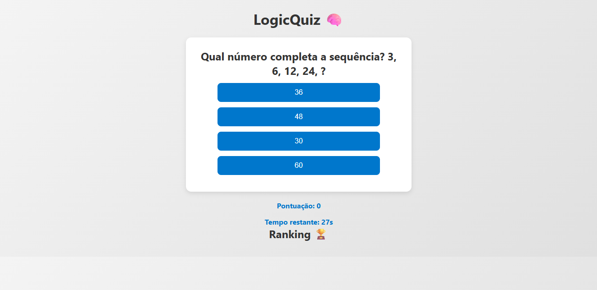

# 🧠 Logic Quiz

Jogo de lógica interativo com perguntas de múltipla escolha, sistema de pontuação e ranking de jogadores.

---

## 🚀 Funcionalidades

- Perguntas de múltipla escolha  
- Sistema de pontuação  
- Ranking com os melhores jogadores 
- Armazenamento de dados no navegador (localStorage)  
- Interface simples e intuitiva  

---

## 🛠️ Tecnologias utilizadas

- HTML  
- CSS  
- JavaScript  

---

## 🎯 Objetivo do projeto

Este projeto foi desenvolvido com o objetivo de praticar lógica de programação, manipulação de DOM e construção de uma experiência interativa para o usuário.

---

## 📸 Preview do projeto

---

## 🌐 Acesse o projeto online

(https://logic-quiz.vercel.app)

---

## 💡 Aprendizados

- Estruturação de lógica condicional  
- Manipulação de elementos com JavaScript  
- Gerenciamento de estado no front-end  
- Uso de armazenamento local (localStorage)  

---

## 📌 Próximas melhorias
 
- Criar níveis de dificuldade  
- Melhorar o design da interface  
- Implementar feedback visual (acerto/erro)
- Inserir botão para retornar ao início quando o jogo finalizar 

---

## 👩‍💻 Desenvolvido por

Aline Dantas
